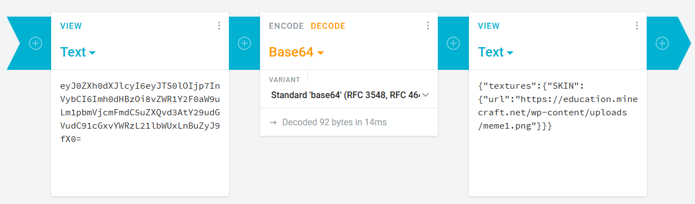

So, my friend has successfully invented the so-called Minecraft HD heads. It's just a simple Minecraft head, but the quality is upscaled, that it's not like "pixelated" anymore. He tells that he could give the steps to do to get it, but I want to try to do it by myself, without any help. I want this as a challenge, something to fill my boredom. 

Actually, I don't want to reverse-engineer the head, but because of difficulties, I need to.

## Clues

So, here's what do we know. 

1. You need [OptiFine](http://optifine.net) to make it work. 
   It must something to do with the HD textures compatibility. Since you don't need to install anything to use an HD Texture (like [BDCraft](https://bdcraft.net/)) 
2. It also uses the same skin format. 
   It uses the 64x64 size for the skin, but there must be some workarounds.
3. You can make any size of your head. 
   My friend tells me that he want's to try a bigger image, so let's assume that you could make it in any size, at least in an exponential. (64x64, 128x128, 256x256, and so on) 
 
My hypothesis is you need to upscale the default skin and you can edit it with [Paint.NET](https://www.getpaint.net/) or whatever (Not [Microsoft Paint](https://en.wikipedia.org/wiki/Microsoft_Paint). It doesn't support transparency), but my friend told me that it won't work, but I'll just try it anyway. 

One thing to note that in a [Phoenix SC](http://youtube.com/phnixhamstasc) live stream, he successfully do a Shrek head on a Giant by just upscale the Zombie skin and then place the Shrek at the head. He also does a bowling pin and a text on the shirt.

## First part: The head

So, let's try to see how OptiFine HD texture works. Well, you just make your texture in any size, and OptiFine will do its job. Well, it is simple, really. Let's try it. 

Here, I have a Twitter logo that I put at the head. I upscaled the texture from 64x64 to 1024x1024. 

{/*   */}

Then, I put it on my resource pack, and, as I expected, it works. 

 

So, this part is simple, you upscale the skin, put the image, and then voila.

## Second part: Make it online and set the head

This is hard to figure this part out. 

At first, I thought that the skin is outside the minecraft.net domain. So, I tried to upload on [cubeupload.com](http://cubeupload.com) and try a skin on [Planet Minecraft](http://planetminecraft.com). That didn't work. 

Then, I use the Minecraft uploader to upload my skin, and then do some things to complete the whole process. That didn't work, even I use that technique where you could use a skin from another website using the skin's URL. 

After lots of despair, I finally looked at the HD Head, and I found the way. It actually uses the [Minecraft: Education Edition](http://education.minecraft.net) website, that is under the minecraft.net domain. 

 

After some clicky-clicks in here and there, I finally get the skin there and use it for the skin, and changed the URL into mine. 

 

On NBTExplorer, I changed the texture using the base64 that's generated, and then changed the UUID into something else. 

 

Okay, testing time. Ah, it works! Finally! Oh yeah, I uploaded the bigger version. 

## Final Words

So, that's how I crack the mystery of the Minecraft HD Heads. It is possible and fairly easy. The matter that makes my finding hard that the workaround that my friend use that is under his sleeves. Anyway, that's for this post and goodbye.
