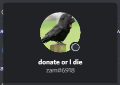

Hey, I decided to start a series of post. I call this series "Scavenger Hunt Writeups". I do this because I'm bored and I like scavenger hunts. This includes those mini-ARG that hosted by some random Discord server. I will do this in a relaxing tone, not as technical as when someone found a critical zero-day exploit. This is the first post, hope you like it. 

This scavenger hunt is hosted by ChillZone ([discord.gg/fun](http://discord.gg/fun)), a populated server which I've never talked to. As a popular server, they like events, this is one of them. This one is quite easy, surprisingly. So, let's get into it.

----

## Stage 1

This one is easy. I just copied the ID of the owner from the announcement channel. 

 

The answer is **170624640308346880**. (.170624640308346880)

----

## Stage 2


This one is also easy. Just google “pi” and you get your answer. The first “3” is also counted, by the way. The answer is **3.141592653**. (3.141592653)

----

## Stage 3


This one is also easy. The numbers are the squared value of the index. So, the first number (n = 1) is 12 = 1, the second number (n = 2) is 22 = 4, the third number (n = 3) is 32 = 9, and so on. So, for the n-th number, the value is n2. 

For some reason, the creator of this stage has a different approach. 

> The difference between 1 and 4 is 3, the difference between 4 and 9 is 5, the difference between 9 and 16 is 7. The number increases by 2 and is added onto the last number.

But, anyway. We got the same answer. The sixth number is 62 = 36, so the answer is **36**. (.36)

----

## Stage 4


So, it refers to a channel on the Discord server about talking good. The channel that it refers to is “#compliment-above”. In the topic channel, you can get the answer.


So, the answer is **friend**. (.friend)

----

## Stage 5


In this one, there are multiple polygons. But, you can see that the green polygon always inside the red polygon and the red polygon is always inside the blue polygon. So, the order of the color is green, red, and blue. 

There are letters scattered on the polygons. The letters can be categorized by the colors. Reading the letters from left to right and top to bottom results in this.

- Green: CODE
- Red: IS
- Blue: 359

As you can see, it reads “CODE IS 359”. So, the answer is **359**. (.359)

----

## Stage 6

 

This is a trivia question. But, searching the messages on the ChillZone server yields this message.


Then, his Discord username is zam#6918



So, the answer is **zam**. (.zam)

----

## Stage 7


Here's the word grid in text.

```
MDHNVDYCWD
WVOLDXQIHX
TETNTZFETR
SZWCTGRAAL
HXNOAERTRR
DMJHQAWVBC
WTGVPAGRVH
VABRDKFQCC
LLFSFLQOYC
PKKMIMCHKW
```

Using an external tool (because I'm lazy), we can find some words. 

 

The most likely words that are used is “don't”, “here”, and “talk”. By putting these words in order to form a sentence, the answer can be found. It is **don't talk here**. (.donttalkhere)

----

## Stage 8


Here's the YouTube link. [https://youtube.com/watch?v=Ba7HpvKJjF0](https://youtube.com/watch?v=Ba7HpvKJjF0) 

This one is easy. The video only contains an audio track. The audio is played backward. Play the audio backward and you can hear “ModSloth likes cheese”. So, the answer is **ModSloth likes cheese**. (.modslothlikescheese)

----

## Stage 9


This trivia question is easy. I just searched the script portion and Google tells me the movie.


The search results refer to The Thing, a sci-fi movie from 1982. So, the answer is **The Thing** (.thething)

----

## Stage 10


This one is actually easy, although I actually overlooked the question. 

There is a confession channel where we can submit our confessions anonymously. So, the question told us to find his confession. I actually skimmed the whole channel to find the answer. Also, I got a clue that the answer has 4 words, but it turns out that the answer has 4 characters. 

 

Anyway, after skimming probably hundreds of confession, I found the answer. The answer is **eggs**. (.eggs)

----

## Stage 11

 

Same as the tenth stage, I just googled the lyrics of the song. 

 

The answer is **Lazarus**. (.lazarus)

----

## Stage 12

 

Alright, this is the hardest question among all the stages on the scavenger hunt. Even the final stage is easier than this one. Lots of people cheated, though, but I figured it out by myself. 

The picture actually resembles the seven segment display that you see in clocks or such. To solve it, just invert the segments, so the active segment becomes inactive and vice versa. 

 

 

So, the answer is **503** (.503). The clue confirms the answer since the third letter of the alphabet is C.

----

## Final Stage

 

The final stage! So, we need to find a question to solve this stage. On my way to this stage, I also looked at the channel topics and surely it hides something. There are spoilers that contain words. Those words can be arranged into a question. 

<div id="carousel" class="carousel slide" data-ride="carousel">
	<div class="carousel-inner">
		<div class="carousel-item active"></div>
		<div class="carousel-item"></div>
		<div class="carousel-item"></div>
		<div class="carousel-item"></div>
		<div class="carousel-item"></div>
		<div class="carousel-item"></div>
		<div class="carousel-item"></div>
		<div class="carousel-item"></div>
		<div class="carousel-item"></div>
		<div class="carousel-item"></div>
		<div class="carousel-item"></div>
		<div class="carousel-item"></div>
	</div>
	<a class="carousel-control-prev" href="#carousel" role="button" data-slide="prev">
		<span class="carousel-control-prev-icon" aria-hidden="true"></span>
		<span class="sr-only">Previous</span>
	</a>
	<a class="carousel-control-next" href="#carousel" role="button" data-slide="next">
		<span class="carousel-control-next-icon" aria-hidden="true"></span>
		<span class="sr-only">Next</span>
	</a>
</div>

So, the question is “How many self-assignable roles do we have currently on the server?” As of the time of writing, there are 64 unique self-assignable roles spread into 3 categories.

- Velvet
- Maroon
- Red
- Halloween Orange
- Orange
- Sand
- Camel
- Brown
- Sunshine Yellow
- Yellow
- Lime Green
- Neon Green
- Tree Green
- Green
- Starbucks Green
- Skobeloff
- Teal
- Turquoise
- Blizzard Blue
- Mint
- Discord Color
- Light Blue
- Blue
- Sky Blue
- Picasso Blue
- Dark Blue
- Navy
- Indigo
- Bubble Gum
- Pink
- Unknown Color
- Magenta
- Fuchsia
- Lavender
- Tinted Lavender
- Bright Purple
- Purple
- Dark Purple
- Grey
- White
- Dark Grey
- Black
- Male
- Female
- Non-Binary
- Asia
- Europe
- Americas
- Oceania
- Africa
- Android
- Apple
- Introvert
- Extrovert
- Instagram
- Twitter
- Netflix
- YouTube
- Reddit
- Fortnite
- PUBG
- Updates
- Giveaway Reminders
- Events

So, the answer is **64**. (.64)
