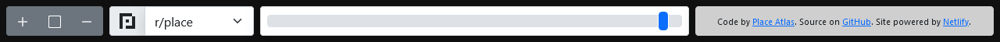

import Image from '../../components/PrettyImage.astro';
import AnalyticsChart from '../../components/PostSpecific/building-the-atlas/AnalyticsChart.astro';

We got a green light where, after a setback of events, r/place made its comeback in 2023. It's a huge news for me, as I with my team on Place Atlas Initiative did some preparations behind-the-scenes in case this really happened (there are hints, but it was not the April Fools event), and then we know that it's really, really happened.

It's been a pleasure to work on this project along with the team, so here are some things regarding the Atlas and its development, both on last year and this year. I promise no ChatGPT is used.[^cowritten]

For the note, there are plenty of instances of the Atlas, both on the organization and from myself, but as a starting point, you can take a look at the 2023 Atlas on https://2023.place-atlas.stefanocoding.me/, or take a look at the 2022 Atlas on https://2022.place-atlas.stefanocoding.me/.  

## A short overview of r/place and the Atlas


For those who didn't know r/place or Reddit,[^blocked] r/place is an event since 2017, where there is a blank canvas in which people can place a single pixel with an interval amount of time (usually 5 minutes). With collaboration, a group of people can draw art in it, putting them in the history of Reddit (probably). Of course with such scale of the website itself, there can be alliances or rivalries.

In 2017 and 2022, r/place is just an April Fools event that lasts for few days. For the 2023, it made a comeback, not in April, but in the end of July, in the midst of the controversial API changes. It sure is a bad time for Reddit,[^rip-joey] but in the Atlas, we go on.

What does the Atlas do? Simple: We document each artwork as a map for people to see. The Atlas is built with entries, containing the name of the artwork, the area of the artwork, the description of it, and the relevant links. I like documenting things, and the mission of the Atlas is appropriate for me to contribute.

## How I contributed (and somehow being part of the team)

<Image src="https://github.blog/wp-content/uploads/2020/12/wallpaper_header_4Ksuper_wide_32_9.png" alt="Ilustration showing Mona staring on the side, with the globe with GitHub activity behind her. (GitHub)" width="2560" height="720" />

For transparency, I'm now at the position of "Developer Team Leader", but I have to start this with an important note: I don't intend to joining the staff team or the organization per se.

The unique nature of an open source project is that you can just come up to them, try improve the project in some way or another, and hopefully your changes are recognized and being implemented, if the project owners/members said so. This is a real-life experience, with an plus (or minus) of having less responsibility than a working job, something that you can put in your own resume. But, that's not my primary intention either.

My intentions are simple: I just want to help. That's it all. I don't want to give too much value of my contributions, as I don't want the sunk-cost fallacy to come bite me. Should they accept my pull request, that's nice, as it is one more part of something that I made better. If they don't, so be it, there are more opportunities out there.

With it being based from an old project from 2017, there are many things that can be improved on The 2022 r/place Atlas. First it's [just documentation changes](https://github.com/placeAtlas/atlas-2022/pull/437), then [just data changes](https://github.com/placeAtlas/atlas-2022/pull/478), then [a big one](https://github.com/placeAtlas/atlas-2022/pull/945), [and another one](https://github.com/placeAtlas/atlas-2022/pull/1092), [and the editing one](https://github.com/placeAtlas/atlas-2022/pull/1149). Being able to edit existing entries is a big deal, but so much is changed that it is decided it would be [a remaster](#the-remaster).

At this point I was invited to as an member of the team, which I gladly accepted, but I still adamant with the fact that this is just helping. It all comes down to the fact that in a morning, I was shocked that I have been granted the role of the said leader. "With great power comes great responsibility." I remind myself as besides being grateful, but it's still comes as a shocker to me.

To this date I still put out some improvements on the project when I get time, beside the one Archival Team colleague that still building upon the Atlas data. The potential 2023 event is something I also look after, improving the Atlas leading up to the event, in case there is, and there actually is.

## The problem of the aging code

As mentioned before, the 2022 Atlas is made upon [the original r/place Atlas](https://github.com/RolandR/place-atlas) from 2017, made by [Roland Rytz](https://github.com/RolandR). Everything of the Atlas engine itself is built ground up, and you should appreciate it. But, sure, there are more things that can be improved, like the contributors credits that can be automated, or the Atlas data that can be separated due to the large size, or the fact that edits are done manually.

The 2022 Atlas itself is started by [Stefano Haagmans](https://stefanocoding.me) after finding out the existence of the 2017 one. Picking up the previous project is not bad, since you don't want to have duplicate work that can went wasted. You still want to keep it updated, though, especially since there are better ways from the development of the web ecosystem. The 2022 Atlas has its own improvements, but again, more can be done.

## The remaster

On April 2022, several days after the end on the 2022 event, [I started working on a PR that adds editing](https://github.com/placeAtlas/atlas-2022/pull/1149). As time progresses, I worked on several other things on this PR.[^feature-creep] The scale of the PR became so large, it was decided that it would be better to spin it as the remaster ([issue](https://github.com/placeAtlas/atlas-2022/pull/1314), [PR](https://github.com/placeAtlas/atlas-2022/pull/1315)).[^loose-remaster]

The remaster also introduces [the new interface](#a-fresh-interface), mainly handled by [mxdanger](https://github.com/mxdanger), along with several other contributors who lend an hand on it. The PR is released on May 2022 with [an annoucement](https://discord.com/channels/960791635342524496/960822640879226890/974783885508476968).

## The Atlas data

The Atlas data stored on a JSON file called `atlas.json`. Initially in 2017, this data is included inside a JavaScript file. Thank goodness that it is seperated, starting in 2022.

There are several improvements that is made on the remaster compared to the 2022.
- Last time there can be only one subreddit and one website, inside the key of `subreddit` and `website`. Now, the Atlas can accept multiple links, along with it also accept Discord invite links and the page on the wiki. All of this now located on the `links` key.
- Paths and centers also have to be adjusted for variations of the area across canvas variations and periods.
- The `submitted_by` was replaced in favour of `contributors`, but then removed in favour of the inclusion on `all-authors.txt`, due to the fact that would be too tedious to maintain it.

Note that contrary to the headline of [the LinkedIn post][linkedin-post], there is no backend. The project is just a static website, with the repository hosted on GitHub.

## Editing entries


In 2022, editing is now possible using the same draw mode on the web interface. Before this, editing is only possible by editing the `atlas.json` via Git/GitHub. I took the mission to implement it myself, letting the draw feature to be able to modify existing entries instead of just creating new ones.

## Accepting submissions (now with edits)

The submission processing workflow is updated in the 2022 Atlas to increase the efficiency on implementing the changes of the Atlas data that is made from the web interface.

Initially in 2017, the Atlas is added manually, and after the short while, `redditcrawl.py` is made, which is still used on the later Atlas instances. With the addition of entry editing, this needs to be adjusted, along with further polishes along the way.

`merge_out.py` was made to merge what is outputted on `temp-atlas.json` to the main `atlas.json` file. I assume that the reason that it was separated on `temp-atlas.json` is to let those who maintain the data to check the submissions before merging it, but before `merge_out.py` is added, merging it would still need to be done manually, especially when handling edits, so this would make it easier to merge it.

In 2023, the workflow is reworked to use the patch system, which makes it possible to include changes submitted from Reddit and GitHub, besides the manual requests which are still serviced manually to this date. Before this, Reddit is used for most edits, while GitHub is used for major edits, compared to what it is today where both are easily accepted.

## The patch system

The submission processing system that is implemented on the 2022 Atlas offers easy integration of additions and edits from Reddit. However, this had some issues.

1. It's hard to accept new entries on GitHub. Around the time when the 2022 event has ended, PRs, most of the submissions were about adding new entries. Conflicts are easy to made, and with the scale, it would be a collosal, tedious task for the Archival Team to handle.
2. Compared to the IDs on 2017, which primarily use an incremental number system, The ID of the new entries now depends on the ID of the Reddit post. Now this may be a matter of preference of the Archival Team, who adjusts it based on usage, which makes it easier on adding new entries from various sources, it seems.
3. The limitations of the Reddit API [that are newly adjusted](https://en.wikipedia.org/wiki/2023_Reddit_API_controversy) has a possibility to impose some problems.

Starting in 2023, the submission workflow is reworked to use a new patch system. GitHub users are now welcome to create file-based patches, similar to how [Changesets](https://github.com/changesets/changesets) are created. This should give a similar experience as how Reddit submissions work.

For the Reddit submissions, instead of putting every submissions in one `temp-atlas.json` basket, `redditcrawl.py` has been adjusted to convert them to patches instead. `merge_out.py` would merge all of these patches into the main `atlas.json` data, instead of `temp-atlas.json` only.

This would solve the following problems by having these.

1. In most cases, PRs would not conflict as people only need to write a separate files instead of storming on `atlas.json`, all at once.
2. The dependency on Reddit is reduced. By having less submissions to fetch on Reddit, we can stay under the limit on Reddit API. When submissions can't be made on Reddit, an easy enough alternative is available.
3. Contributing via GitHub is now easier than ever. Submitting patches is can be as easy as adding a new file from GitHub without cloning the repository.

The utilization of this feature is reflected with the PR traffic on the the 2023 Atlas. During the period of the event, ~200-300 PRs can be made, and it doesn't take long that we get the #1000 mark.


## Periods and variations



In 2022, the feature of periods and variations is implemented. Mind the two terminologies.

- Canvas variations are referring to the different canvas versions that are distinct to each other. For example, both default r/place canvas and The Final Clean canvas are different variations. This is shown as a dropdown.
- Periods are referring to the group of canvas versions that are different in time/period. For example, there are 30-minute versions of the default r/place canvas as its periods. This is shown as a slider.[^period-not-strict]

Before this, the Atlas only supports one canvas, and one canvas only. Few suggestions were made regarding this.

1. Few people requested for a "time travel" feature, which is the initial idea of all of this.
2. We want to add The Final Clean canvas in it too.

In 2022, I took the mission to implement the feature of periods and variations. Of all the changes regarding this, the primary ones are as follows.

1. Implement periods for the "time travel" things
2. Implement variations for The Final Clean canvas
3. Adjust Atlas data to support these periods and variations, since an entry/art can change from time to time.

When implementing it, size are a primary concern. Before this, I'm thinking on having 1 hour canvas periods for the default canvas, but discussion leads to having 30 minute periods instead. Further optimization on size are made by compressing the images and using difference layers, courtesy to [Scaevolus](https://github.com/Scaevolus).

## A fresh interface


[mxdanger](https://github.com/mxdanger) took this part along with the remaster process, rewriting the whole interface using Bootstrap 5.2 with dark mode[^bs53-color-modes]. It is a pure contrast from the old one to the fresh modern interface, along with making it more accessible and hopefully easier to use.

Improvements regarding the user interface and experience are still done to this date, subject to availability.

## The website hosting


It is possible to use GitHub Pages, but we used Netlify, starting on 2017, whose Stefano, the project lead, had good relations on them. Netlify provides a good plan for open source projects. [We even have to request for the assistance due to the peak traffic in 2022](https://answers.netlify.com/t/immenent-urgency-were-in-dire-need-of-a-bandwith-increse/54550/11).

Shown below is the chart of the pageviews and bandwidth used in the event period. At its peak, there are close to 3 million page views in a range of 7 days, and 11 TB bandwidth used in a range of 7 days.

<AnalyticsChart />

Netlify also has the Deploy Preview feature, which makes previewing changes easier. I even added support to preview the pending patches by having it merged in Deploy Preview, which hopefully useful to some.

## The case of caching (and PWA)

In 2022, I've implemented some sort of a caching feature by fetching the images and save it in a JavaScript object, in addition to `Cache-Control` based caching. This should reduce the time when seeking the timeline slider, and reduce the bandwidth usage for Netlify and you, the users.

One small problem is that it is only available on the session; it will be removed after the page is closed or reloaded. Besides, [Stefano have implemented some sort of Progressive Web App features using PWABuilder](https://github.com/placeAtlas/atlas-2022/commit/3ea5b5d0c4ec7554a78de2dca09b60e30aa93424) which includes having service workers, which can save stuff on the cache storage for offline usage.

```js
workbox.routing.registerRoute(
    new RegExp('/*'),
    new workbox.strategies.StaleWhileRevalidate({
        cacheName: "pwabuilder-offline",
        plugins: [
            new workbox.backgroundSync.BackgroundSyncPlugin("bgSyncQueue", {
				maxRetentionTime: 24 * 60 // Retry for max of 24 Hours (specified in minutes)
			})
        ]
    })
);
```

An idea appeared to in my head to utilize this further, so I worked on it to implement a better caching based on service workers. The cache have been split into two, one for canvas images, which are large and rarely changed, and uses the `CacheFirst` strategy instead of `StaleWhileRevalidate`, and one for the other files, which may change more often.

```js
workbox.routing.registerRoute(
    ({ url }) => !url.pathname.startsWith('/_img/canvas/'),
    new workbox.strategies.StaleWhileRevalidate({
        cacheName: "main",
        plugins: [
            new workbox.backgroundSync.BackgroundSyncPlugin(
                "main-queue", {
                    maxRetentionTime: 4 * 7 * 24 * 60 // 4 weeks (in minutes)
                }
            )
        ]
    })
);

workbox.routing.registerRoute(
    ({ url }) => url.pathname.startsWith('/_img/canvas/'),
    new workbox.strategies.CacheFirst({
        cacheName: "canvas"
    })
);
```

Alongside with that, I've extended the `Cache-Control` `max-age` to 1 week, and then 1 year for the canvas images and hashed resources. Having these should greatly improve the performance and experience for the Atlas users, as well as having to use less bandwidth as before.

## Updating the canvas during the event

In 2023, we decided to do something new: To open submissions at the start of the event and updating the canvas as time goes on. This gives us few advantages.

1. There will be more entries as contributors are submitting entries that are present on the latest canvas at the time, reducing the missed entries on the past canvases.
2. Instead of having a single period point, the period of the entries can be extended conservatively as new canvas added by the team, increasing the quality of the data. Entries that shouldn't be extended can be edited by contributors to be fixed.

[Alex Tsernoh](https://github.com/ProstoSanja) gave a lending hand to help when running the scraper for both on the VPS and for [AnonymousRandomPerson](https://github.com/AnonymousRandomPerson). After the first hours of taking off, an implicit rotating shift is made by me and ARP to adding the canvas. As the leader of the Archival Team, ARP would be the one who accept contributions and is managing it on the western hemisphere, while I would be just extending the existing entries and being active in the eastern hemisphere. Both of us are adding the new canvas versions alternately, with both scrapers are set up on ARP's side and on the VPS that are primarily managed by me.

There are some challenges, especially on my side:

- There are some parts when something messed up on the VPS, especially the authentication. Scaevolus is also running a version of the scraper, and was present to fill the missed periods.
- I accidentally broke something significant to the point that it generates a broken patch. It must be happened on my shift where I continued to tinker the Atlas, and the issue is realised by ARP on his shift. Don't push to prod, kids.

At the end, the experience of maintaining something this active is interesting. Even though it is quite tedious, it was worth it, especially with the length of the event which is longer than before.

The scraped canvas images from the internal VPS has been uploaded to [Internet Archive](https://archive.org/details/place-atlas-2023-scraped-canvas), although there are alternative sources that you can use, such as [the scrape of all images by Scaevolus](https://archive.org/details/rplace_2023_all_images) or if you are ambitious, use [the official dataset](https://www.reddit.com/r/place/comments/15bjm5o/rplace_2023_data/).

## Closing and takeaways

I think that's all that I can say on this post. I suck at closing, but here are some takeaways from my side.

1. It's nice to be able to help with the project, besides having a real-life experience in an active project. If you have an experience of programming, consider contributing to the open source projects. I'm pretty sure you can improve on your skills, either on programming or not, like communication or documentation.
2. I would agree with a takeway made by Stefano on his LinkedIn post that this is one of the times where collaboration (and creativity?) works on creating something awesome. Reddit is more community-oriented than other platforms, and having this open would be essential, for the legacy and the longetivity of the project. Even with ups and downs, I think a lot of people, including me, are satisfied with the results, and I can't wait to see what we can do in the future as a community.

For the development, I would like to thank the whole team of the Place Atlas Initiative that made it possible, with special shoutouts to [Stefano](https://stefanocoding.me), [AnonymousRandomPerson](https://github.com/AnonymousRandomPerson), [Alex Tsernoh](https://github.com/ProstoSanja), [mxdanger](https://github.com/mxdanger), as well as the other members of the team, past and present, and [Roland Rytz](https://github.com/RolandR) as the trailblazer. I would also thank everyone who have contributed on the project, from entry contributors to those who helped with issues, docs, code, and even general support.

For you, the readers, thank you for reading this post. I hope you can learn one or two things about it, and hopefully know about how far these projects can take you to. If there are any comments, please do not hesitate to put it on the comment box.

[linkedin-post]: https://www.linkedin.com/pulse/exploring-magic-rplace-atlas-its-backend-stefano-haagmans
[^cowritten]: Oh, yeah. [That LinkedIn post][linkedin-post]: "Co-written by #ChatGPT", by chance.
[^blocked]: Reddit is blocked in my country. The fact that I can access and contribute a project that is related to Reddit speaks itself about the "legality" of the work.
[^feature-creep]: I swear it's not a feature creep! We have checks and balances, and the problem of feature creeping has been raised before. It is still used to this date.
[^rip-joey]: And for me. I am a proud user of Joey for Reddit and it's now dead. May it rest in peace.
[^loose-remaster]: Keep in mind that the word "remaster" or "remastered" is defined quite loose here.
[^period-not-strict]: Keep in mind that how it is utilized is not that strict. For example, I can add the TFC overlays on top of the base TFC canvas and put is as a period after the base.
[^bs53-color-modes]: Remember, [color modes](https://getbootstrap.com/docs/5.3/customize/color-modes/)/dark mode is not a thing until [Bootstrap 5.3](https://blog.getbootstrap.com/2023/05/30/bootstrap-5-3-0/#dark-mode)! It was not available at that time. 